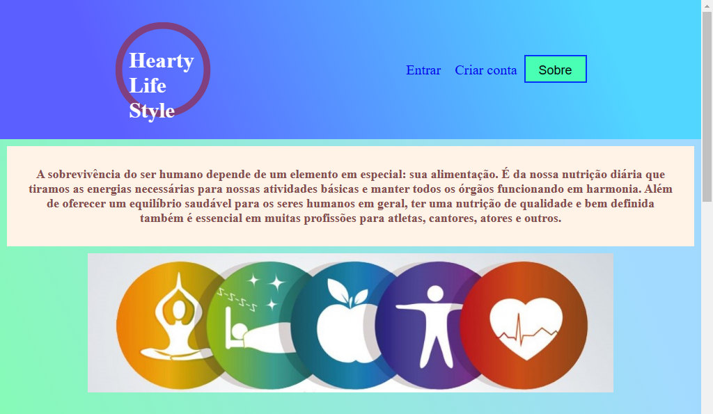
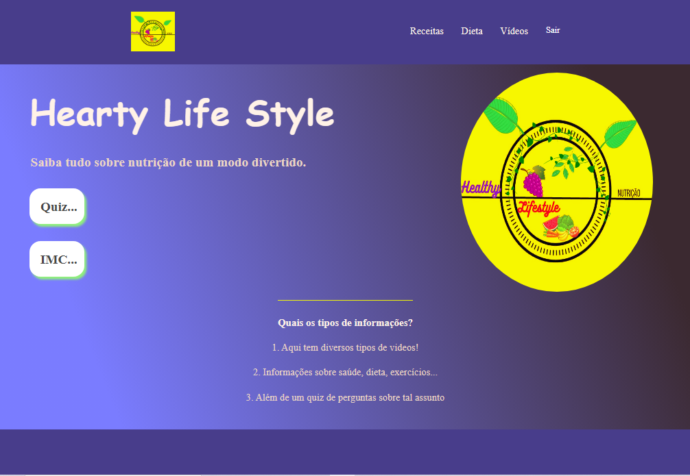
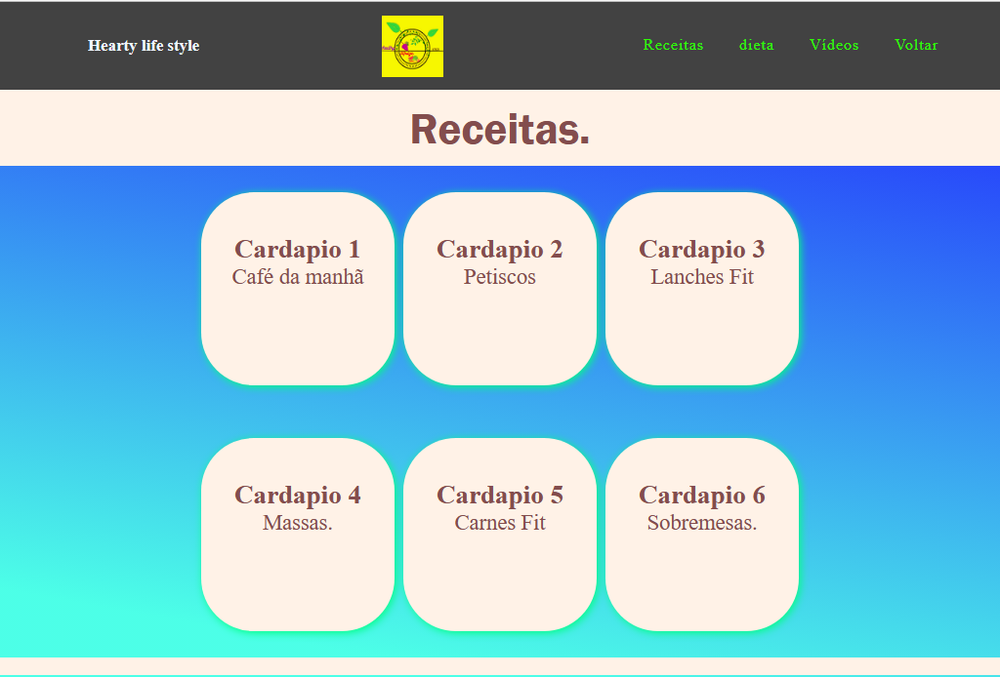

Meu tcc do curso técnico de informática!

 Desenvolvido com HTML, CSS, JS, PHP e o banco de dados mysql.

<strong>--FOTOS DO PROJETO--</strong>

 
  
 
  
 
  
 
  

<strong>Sobre:</strong>
A ideia principal do projeto consistiu na informatização do Hearty Life Style, uma empresa virtual no campo da nutrição.

O objetivo foi levar informações sobre nutrição, dicas, receitas, tudo isso de forma a facilitar a vida das pessoas, diante de uma rotina de trabalho árdua, sem deixar de manter uma rotina saudável. Tal tema foi adotado com base em pesquisas, onde se verificou o grande volume de dados de interesse no tópico selecionado, ainda mais depois do advento da pandemia por Covid-19. Um ponto relevante do site é a informatização do site nutricional, baseando-se em estudos e intensas pesquisas constatou-se que muitas pessoas não praticam hábitos saudáveis por conta da falta de tempo, acesso ilimitado a informações nutricionais

importante!
Para usar o projeto vc precisa criar
um banco de dados e fazer conexão...

link do site hospedado:
https://heartylife.000webhostapp.com/